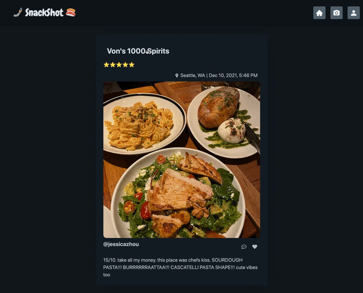
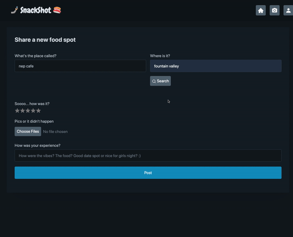

# SnackShot - Social Media for Foodies

This is a [Next.js](https://nextjs.org/) project bootstrapped with [`create-next-app`](https://github.com/vercel/next.js/tree/canary/packages/create-next-app).

## Overview
Full stack MVP application that allows users to share restaurant recommendations with friends via photos + access external Yelp reviews.



## Table of Contents
- [Description](#description)
- [Installation](#installation-and-setup)
- [Technologies](#technologies)
- [Project Details](#project-details)
- [Contributor](#contributor)

## Description
I wanted to create an environment where food enthusiasts could share their most recent restaurant discoveries with friends and get inspiration for new places to explore -- a mix between Yelp and Instagram, as I like to say. 

---

## Installation and Setup
1. Fork and clone the repo and navigate to the root directory.

2. To install dependencies:
```
npm install
```

3. To run the development server:
```bash
npm run dev
# or
yarn dev
```

4. Open http://localhost:3000 in your browser

5. Firebase setup: 
Create a New Project and add the information to a .env
```json
"NEXT_PUBLIC_FIREBASE_API_KEY"="API_KEY"
"NEXT_PUBLIC_FIREBASE_AUTH_DOMAIN"="AUTH_DOMAIN"
"NEXT_PUBLIC_FIREBASE_PROJECT_ID"="PROJECT_ID"
"NEXT_PUBLIC_FIREBASE_STORAGE_BUCKET"="STORAGE_BUCKET"
"NEXT_PUBLIC_FIREBASE_MESSAGING_SENDER_ID"="SENDER_ID"
"NEXT_PUBLIC_FIREBASE_APP_ID"="APP_ID"
```

---

## Technologies
- [Next.js](https://nextjs.org/docs)
- [React](https://reactjs.org/)
- [Typescript](https://devdocs.io/typescript/)
- [Firebase](https://firebase.google.com/docs)
- [Vercel](https://vercel.com/docs)
- [Styled Components](https://styled-components.com/docs/)
- [Pico CSS](https://picocss.com/docs/)

---

## Project Details
### Home page
>This page displays posts from all the user's friends. It allows users to see Yelp data and save posts for future use, and it features photo carousels. 


### New post
>This section allows the user to upload a new post to his or her feed. It has a search mechanism that finds a matching restaurant based on name and location and allows photo uploads and rating stars.  


### Profile page
>This is the user's personal page, where the previous posts, friend list, and saved posts are displayed.


---

### Contributor
- [Jessica Zhou](https://github.com/jessicazhou86)
